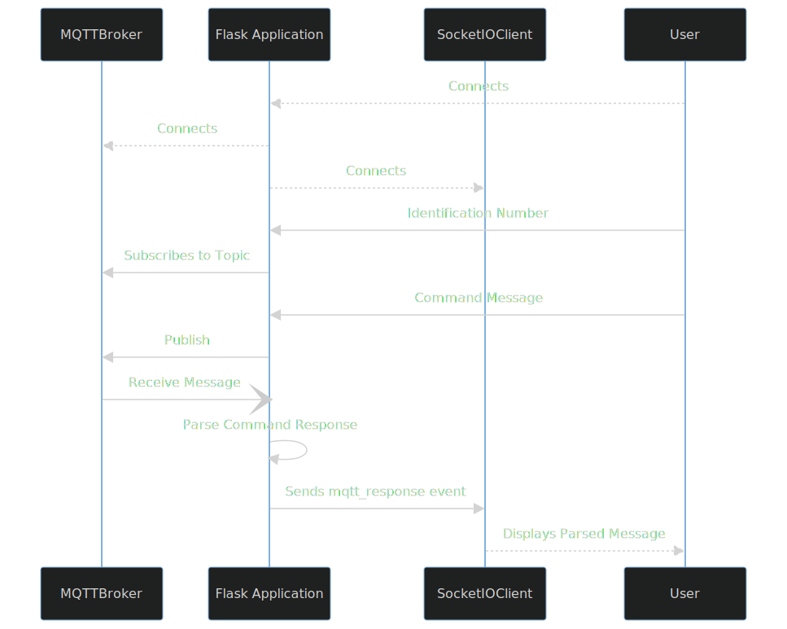

# CVP Protobuf Encoded Communication Testing Server.


**Must See: [Notes on Flask, WTForms, Protocol Buffers and more…](https://abd-01.github.io/Flask-Protobuf/Notes.html)**


<!-- index.rst content start -->

The CVP Proto Server is a versatile tool designed for seamless communication using Protocol Buffers (protobuf) for CVP messages. This server provides a Command-Response Commander via a Command Line Interface (CLI) and a Flask application for handling MQTT communication with CVP messages.




## Installation

To install the CVP Protobuf Server, download the `protoserver-1.0.0-py3-none-any.whl` file and run the following command:

```bash
pip install protoserver-1.0.0-py3-none-any.whl
```

## Features

- **CLI Command-Response Commander:** A terminal interface for generating command messages and decoding command response messages effortlessly based on user input. 

Usage:
```bash
commander
```


- **Flask Application for MQTT Communication:** The Flask application is designed to offer users a user-friendly web interface, incorporating Bootstrap for an enhanced visual experience and dynamic form generation. This allows users to easily handle MQTT communication with CVP messages. The integration of Socket.IO ensures real-time updates, providing immediate feedback. This combination of technologies creates a seamless and interactive environment, simplifying the process of generating, sending and receiving messages. 
Usage:
```bash
tmcvp-server-flask
```

**The static depiction of Flask Application can be seen [here](https://abd-01.github.io/Flask-Protobuf/demo-protoserver.html)**

## Scaling for Future Usage

The server is designed with scalability in mind, anticipating future changes and updates to the CVP protocol. It is independent of specific command subtype payloads, providing flexibility for integration with new message types or additional fields introduced in future versions.

While the server code is designed to be independent of specific payload details, it is not agnostic to changes in message header if any occurs. I have assumed that the fields such as  `message_id`, `message_type`, `priority`, `packet_status`, etc, are present in future protocol versions.
